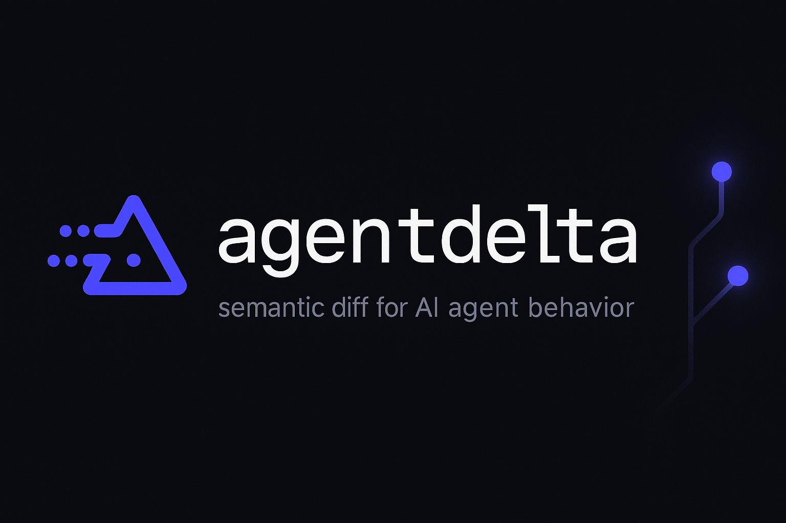
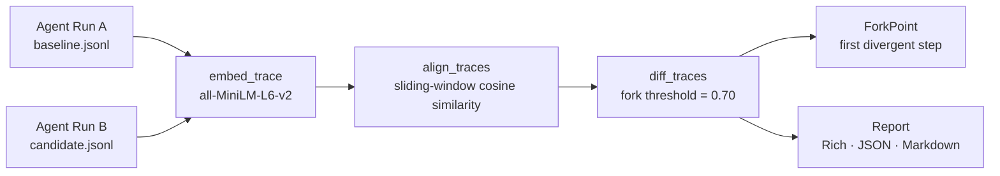

<div align="center">



<br/>

**`git diff` for how your AI agent thinks.**

Detect the exact step where two agent runs diverged — which tool it switched to, when its reasoning changed, what prompt edit caused the fork. Built for CI/CD on AI agents.

[](https://github.com/sandeep-alluru/agentdelta/actions/workflows/ci.yml)
[](https://pypi.org/project/agentdelta/)
[](https://pypi.org/project/agentdelta/)
[](https://pypi.org/project/agentdelta/)
[](LICENSE)
[](https://codecov.io/gh/sandeep-alluru/agentdelta)
[](https://mypy-lang.org/)

[Quick Start](#quick-start) · [How It Works](#how-it-works) · [CLI Reference](#cli-reference) · [GitHub Action](#github-action) · [vs. Alternatives](#vs-alternatives) · [Contributing](CONTRIBUTING.md) · [Changelog](CHANGELOG.md)

</div>

---

> [!NOTE]
> agentdelta evaluates **behavior**, not output. Two runs can produce identical final answers while the agent took completely different paths — calling different tools, in different orders, with different reasoning chains. agentdelta catches that.

---

## Why

Most LLM evaluations check: *did the agent get the right answer?* They miss the harder question: *did it get there the same way?*

- **Prompt changes are invisible** — tweaking a system prompt can silently flip which tool an agent calls first, changing latency, cost, and reliability without touching the output
- **Model upgrades change behavior** — moving from GPT-4o-mini to GPT-4o or Claude 3.5 Sonnet → Opus changes reasoning paths even when benchmark scores stay flat
- **Tool-calling regressions are silent** — an agent that starts calling `web_search` instead of `read_database` may produce correct answers today and fail tomorrow when the web page moves

agentdelta gives every agent deployment a behavioral fingerprint so you can detect divergence in CI before it reaches production.

---

## Quick start

**Install:**

```bash
pip install agentdelta
# or zero-install with pipx:
pipx run agentdelta --help
```

> **Note:** First install downloads PyTorch and CUDA libs (~2.5 GB). For CPU-only systems:
> `pip install agentdelta --extra-index-url https://download.pytorch.org/whl/cpu`

**With LangChain/LangGraph:**

```bash
pip install "agentdelta[langchain]"
```

> The `[langchain]` extra is only needed if instrumenting a real LangChain agent. `AgentdeltaCallback` can be used directly with any framework.

**Capture two runs (self-contained — no LangChain required):**

```python
from agentdelta.instrument import AgentdeltaCallback
from agentdelta import AgentTrace, diff_traces
from agentdelta.report import print_diff

class _FakeLLMResponse:
    def __init__(self, text):
        self.generations = [[type("G", (), {"text": text})()]]

def build_trace(run_id, tool_name):
    cb = AgentdeltaCallback(run_id=run_id)
    cb.on_chain_start({}, {"input": "What is the weather in Tokyo?"})
    cb.on_llm_end(_FakeLLMResponse("I should look up the weather."))
    cb.on_tool_start({"name": tool_name}, "location='Tokyo'")
    cb.on_tool_end('{"temp": 22, "condition": "sunny"}')
    cb.on_llm_end(_FakeLLMResponse("The weather in Tokyo is 22C and sunny."))
    cb.on_chain_end({"output": "Tokyo: 22C, sunny."})
    return cb.trace

# Baseline run (before your change)
trace_a = build_trace("v1.0", tool_name="get_weather")
trace_a.save("baseline.jsonl")

# Candidate run (after your change — switched to a different tool)
trace_b = build_trace("v1.1", tool_name="web_search")
trace_b.save("candidate.jsonl")
```

**Diff them:**

```bash
agentdelta diff baseline.jsonl candidate.jsonl
```

```
╭───────────────────────────────────────────────╮
│ agentdelta  v1.0 vs v1.1                      │
╰───────────────────────────────────────────────╯
  🔴 REGRESSION DETECTED  3/6 steps matched (50.0%)  1 changed  +1 added  -1 removed

╭────────────────────── Fork Point ──────────────────────╮
│ ⚡ First fork at step 3                               │
│ Tool selection changed: 'get_weather' → 'web_search'  │
│                                                        │
│   Before: get_weather(location='Tokyo')                │
│   After:  web_search(query='Tokyo weather today')      │
╰────────────────────────────────────────────────────────╯

 Step   Status    Type          Detail
    3   CHANGED   🔧 tool_call  Tool selection changed: 'get_weather' → 'web_search'
    4   REMOVED   ↩ tool_return  - [tool_return] {"temp": 22, "condition": "sunny"}
    5   CHANGED   🧠 llm        Reasoning path diverged (similarity: 0.85)
```

---

## How it works



1. **Embed** — each node's content (LLM reasoning, tool calls, tool outputs) is embedded with `all-MiniLM-L6-v2` (22M params, runs locally, no API key)
2. **Align** — sliding-window cosine similarity matches nodes by meaning, not by position — insertions and deletions are handled gracefully
3. **Fork** — the first aligned pair whose similarity falls below `fork_threshold` (default 0.70) becomes the `ForkPoint`
4. **Report** — Rich terminal table, JSON for programmatic use, or Markdown for GitHub PR comments

See [ARCHITECTURE.md](ARCHITECTURE.md) for the full data flow and algorithm details.

---

## Features

| Feature | Description |
|---|---|
| Semantic step alignment | Matches steps by meaning, not index — handles insertions and deletions |
| Fork point detection | Pinpoints the first divergent step with a human-readable explanation |
| Tool change detection | Identifies when the agent switched tools, even with identical arguments |
| Reasoning path diff | Detects LLM reasoning divergence, not just output changes |
| LangChain instrumentation | One-line `record()` context manager — no agent code changes |
| Offline inference | Runs entirely locally — no OpenAI/Anthropic API calls for the diff itself |
| CI/CD integration | `--exit-code` flag for pipeline failures; GitHub Action available |
| Multiple output formats | Rich terminal · JSON · GitHub PR Markdown |
| JSONL trace format | Human-readable, git-diffable, framework-agnostic |
| Content-addressed IDs | Same reasoning step → same node ID across runs |

---

## Python API

```python
from agentdelta import AgentTrace, diff_traces
from agentdelta.report import print_diff, to_json, to_markdown

trace_a = AgentTrace.load("baseline.jsonl")
trace_b = AgentTrace.load("candidate.jsonl")

result = diff_traces(trace_a, trace_b, fork_threshold=0.70, match_threshold=0.85)

# Terminal output
print_diff(result)

# Programmatic access
if result.has_regression:
    fp = result.fork_point
    print(f"Fork at step {fp.step_a}: {fp.description}")
    print(f"Similarity: {fp.similarity:.2f}")

# CI/CD JSON
json_str = to_json(result)

# GitHub PR comment
markdown_str = to_markdown(result)
```

---

## CLI Reference

```
agentdelta diff TRACE_A TRACE_B [OPTIONS]
```

| Option | Default | Description |
|---|---|---|
| `--format` | `rich` | Output format: `rich` \| `json` \| `markdown` |
| `--fork-threshold` | `0.70` | Similarity below this marks a fork point |
| `--match-threshold` | `0.85` | Similarity above this is a match (no change) |
| `--show-matches` | `false` | Include unchanged steps in terminal output |
| `--exit-code` | `false` | Exit 1 if regression detected (for CI) |

```
agentdelta inspect TRACE_FILE
```

Prints a step-by-step summary of a single trace file.

---

## Trace format

Traces are `.jsonl` files — one JSON object per line. Human-readable and git-diffable.

```jsonl
{"type": "trace_meta", "run_id": "v1.0"}
{"type": "node", "step": 1, "node_type": "start",      "content": "What is the weather in Tokyo?", ...}
{"type": "node", "step": 2, "node_type": "llm",        "content": "I should look up the current weather.", ...}
{"type": "node", "step": 3, "node_type": "tool_call",  "content": "get_weather(location='Tokyo')", ...}
{"type": "node", "step": 4, "node_type": "tool_return","content": "{\"temp\": 22, \"condition\": \"sunny\"}", ...}
{"type": "edge", "source_step": 1, "target_step": 2, "edge_type": "sequence", ...}
```

You can generate traces from any agent framework by writing nodes and edges directly, or use the LangChain callback for automatic capture.

---

## GitHub Action

Use agentdelta directly in your GitHub Actions workflow:

```yaml
# .github/workflows/agent-regression.yml
- name: Behavioral diff
  uses: sandeep-alluru/agentdelta@v0.1.0
  with:
    baseline: traces/baseline.jsonl
    candidate: traces/candidate.jsonl
    fail-on-regression: "true"

- name: Post diff as PR comment
  uses: marocchino/sticky-pull-request-comment@v2
  with:
    path: agentdelta-diff.md
```

Or use the CLI directly:

```yaml
- name: Install agentdelta
  run: pip install agentdelta

- name: Behavioral diff
  run: |
    agentdelta diff traces/baseline.jsonl traces/candidate.jsonl \
      --format markdown --exit-code > diff.md

- name: Post comment
  uses: marocchino/sticky-pull-request-comment@v2
  with:
    path: diff.md
```

---

## OpenAI integration

**Codex CLI** — the `CODEX.md` file at repo root gives OpenAI Codex full project context (architecture, invariants, build commands). Clone the repo and Codex is immediately project-aware.

**Assistants API / Responses API** — paste `tools/openai-tools.json` directly into your assistant definition to give it `diff_traces`, `inspect_trace`, and `record_snippet` as callable functions:

```python
import json, openai

tools = json.loads(open("tools/openai-tools.json").read())

response = openai.chat.completions.create(
    model="gpt-4o",
    messages=[{"role": "user", "content": "Did my agent regress?"}],
    tools=tools,
)
```

**GPT Actions / Custom GPTs** — the `openapi.yaml` at repo root is a complete OpenAPI 3.1 spec. To register agentdelta as a ChatGPT Action:
1. Run `pip install "agentdelta[api]" && uvicorn agentdelta.api:app` (or deploy to any host)
2. In ChatGPT → My GPTs → Create → Add Action → import from `openapi.yaml`

---

## Claude / MCP integration

Install the MCP server to use agentdelta as a native Claude tool — no CLI needed:

```bash
pip install "agentdelta[mcp]"
```

Add to your Claude Desktop config (`~/.config/claude/claude_desktop_config.json` on Linux, `~/Library/Application Support/Claude/claude_desktop_config.json` on macOS):

```json
{
  "mcpServers": {
    "agentdelta": {
      "command": "agentdelta-mcp"
    }
  }
}
```

Claude then has three tools: **`diff_traces`**, **`inspect_trace`**, **`record_snippet`** — callable directly in conversation with no shell commands.

**Claude Code slash commands** are included in the repo. After cloning, type `/project:` to see:

| Command | What it does |
|---|---|
| `/project:diff` | Diff two trace files and explain the fork |
| `/project:inspect` | Summarise a single trace's execution path |
| `/project:record` | Generate copy-paste recording boilerplate |
| `/project:add-adapter` | Scaffold a new framework instrumentation adapter |
| `/project:pr-prep` | Run lint + types + tests + CHANGELOG check |

---

## vs. Alternatives

| | agentdelta | LangSmith | Arize / Phoenix | Weave (W&B) |
|---|---|---|---|---|
| **Behavioral diff (two runs)** | ✅ core feature | ❌ | ❌ | ❌ |
| **Fork point detection** | ✅ step-level | ❌ | ❌ | ❌ |
| **Offline / local** | ✅ no API key | ❌ SaaS | ❌ SaaS | ❌ SaaS |
| **CI exit code on regression** | ✅ `--exit-code` | ❌ | ❌ | ❌ |
| **Git-diffable trace format** | ✅ JSONL | ❌ proprietary | ❌ proprietary | ❌ proprietary |
| **GitHub Action** | ✅ | ❌ | ❌ | ❌ |
| **Trace collection** | LangChain/custom | ✅ full platform | ✅ full platform | ✅ full platform |
| **Eval / scoring** | planned | ✅ | ✅ | ✅ |
| **Cost** | free / MIT | free tier + paid | free tier + paid | free tier + paid |

agentdelta is not an observability platform — it is a **diff tool**. Use it alongside LangSmith or Phoenix for collection and scoring, and agentdelta for behavioral regression detection in CI.

---

## Case Studies

See how teams are using agentdelta in production:

- [Catching Invisible Behavioral Regressions in a Fraud Detection Agent](docs/case-studies/fintech-ci-behavioral-regression.md)
- [Behavioral Fingerprinting for FDA-Regulated AI Model Upgrades](docs/case-studies/healthtech-model-upgrade-audit.md)

---

## Repository structure

```
agentdelta/
├── src/agentdelta/
│   ├── trace.py          # Data model: TraceNode, TraceEdge, AgentTrace
│   ├── embed.py          # Embeddings + sliding-window alignment
│   ├── diff.py           # Fork detection → DiffResult, ForkPoint
│   ├── instrument.py     # LangChain callback + record() context manager
│   ├── report.py         # Rich / JSON / Markdown output formatters
│   └── cli.py            # Click CLI (diff, inspect)
├── tests/                # 43 unit tests — pytest
├── examples/
│   └── demo.py           # Runnable end-to-end demo
├── assets/               # Logo, banner, demo GIF
├── .github/
│   ├── workflows/
│   │   ├── ci.yml        # Lint + test + coverage on push/PR
│   │   └── release.yml   # PyPI publish on tag push
│   ├── ISSUE_TEMPLATE/   # Bug report + feature request templates
│   └── PULL_REQUEST_TEMPLATE.md
├── action.yml            # Use agentdelta as a GitHub Action
├── ARCHITECTURE.md       # Full data flow + algorithm details
├── CONTRIBUTING.md       # How to contribute
├── CHANGELOG.md          # Release history
└── SECURITY.md           # Vulnerability reporting
```

---

## Development

```bash
git clone https://github.com/sandeep-alluru/agentdelta
cd agentdelta
python -m venv .venv && source .venv/bin/activate
pip install -e ".[dev]"
pre-commit install

make test       # run the full test suite (43 tests)
make lint       # ruff check + format
make typecheck  # mypy
make all        # lint + typecheck + test
```

See [CONTRIBUTING.md](CONTRIBUTING.md) for the full guide including how to add output formats and instrumentation adapters.

---

## License

MIT — see [LICENSE](LICENSE).

---

## GitHub Topics

If you're adding this repo to GitHub, set these topics for maximum discoverability:

```
llm  agents  langchain  diff  regression-testing  mcp  behavioral-testing  ci-cd  openai  python
```

---

<div align="center">

[](https://star-history.com/#sandeep-alluru/agentdelta&Date)

*If agentdelta saved you from a silent behavioral regression, consider giving it a ⭐*

</div>
