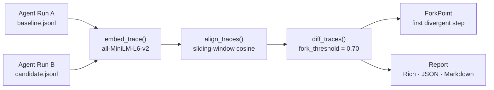

# How It Works

## The problem

Most LLM evaluations check: *did the agent get the right answer?*

They miss the harder question: *did it get there the same way?*

Two agent runs can produce identical final answers while taking completely different paths — calling different tools, in a different order, with different reasoning chains. These silent behavioral changes are the root cause of:

- **Latency surprises** — a new reasoning path calls an extra tool
- **Cost surprises** — a different tool is cheaper or more expensive
- **Reliability regressions** — `get_weather` is stable; `web_search` can fail if the page moves
- **Compliance violations** — a model upgrade routes through an unapproved data source

## The solution

redline gives every agent run a **behavioral fingerprint** and lets you compare two fingerprints.

## Pipeline

### 1. Record

The `record()` context manager wraps a LangChain agent and captures every LLM generation, tool call, and tool return as a `TraceNode`. Each node gets a content-addressed ID (SHA-256 of its type + content), so the same reasoning step produces the same ID across different runs.

### 2. Embed

`embed_trace()` runs every node's content text through `all-MiniLM-L6-v2` (22M params, runs locally, no API key). This produces a 384-dimensional float vector for each step that captures semantic meaning — not just keyword matching.

### 3. Align

`align_traces()` uses a greedy sliding-window algorithm to match nodes from trace A to trace B by semantic similarity. It handles insertions and deletions gracefully: if trace B has an extra tool call that A doesn't, the surrounding steps still align correctly.

### 4. Fork

`diff_traces()` labels each aligned pair as `match`, `changed`, `added`, or `removed`. The first `changed` pair (similarity < `fork_threshold`) becomes the `ForkPoint` — the exact step where behavior diverged.

### 5. Report

Three output formats:

- **Rich terminal** — colored table, highlighted fork point, human-readable diff
- **JSON** — machine-readable, suitable for CI scripts and dashboards
- **Markdown** — GitHub PR comment format with collapsible diff table

## Thresholds

| Parameter | Default | Meaning |
|---|---|---|
| `fork_threshold` | `0.70` | Similarity below this → behavioral change detected |
| `match_threshold` | `0.85` | Similarity above this → steps are equivalent |
| window (alignment) | `5` | How many positions to search for a match (±5 steps) |

The zone between `fork_threshold` and `match_threshold` is "changed but not a fork" — it appears in the step table but doesn't set `has_regression`. This lets you distinguish minor paraphrase from genuine behavioral divergence.
