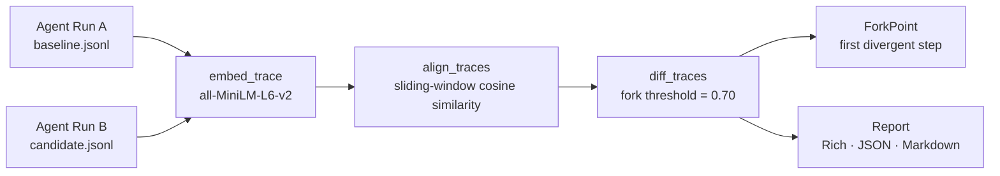

# agentdelta

**`git diff` for how your AI agent thinks.**

Detect the exact step where two agent runs diverged — which tool it switched to, when its reasoning changed, what prompt edit caused the fork. Built for CI/CD on AI agents.

---

!!! note "Evaluates behavior, not output"
    Two runs can produce identical final answers while the agent took completely different paths —
    calling different tools, in different orders, with different reasoning chains. agentdelta catches that.

## Install

```bash
pip install agentdelta
# with LangChain support
pip install "agentdelta[langchain]"
```

## Quick example

```python
from agentdelta import record

# Baseline (before your change)
with record("baseline.jsonl", run_id="v1.0") as cb:
    agent.invoke({"input": "What is the weather in Tokyo?"}, config={"callbacks": [cb]})

# Candidate (after your change)
with record("candidate.jsonl", run_id="v1.1") as cb:
    agent.invoke({"input": "What is the weather in Tokyo?"}, config={"callbacks": [cb]})
```

```bash
agentdelta diff baseline.jsonl candidate.jsonl
```

```
🔴 REGRESSION DETECTED  3/6 steps matched (50.0%)  1 changed  +1 added  -1 removed

Fork at step 3 — Tool selection changed: 'get_weather' → 'web_search'
```

## Why

Most LLM evaluations check: *did the agent get the right answer?* They miss the harder question: *did it get there the same way?*

- **Prompt changes are invisible** — tweaking a system prompt can silently flip which tool an agent calls first
- **Model upgrades change behavior** — moving from GPT-4o-mini to GPT-4o changes reasoning paths even when benchmark scores stay flat
- **Tool-calling regressions are silent** — an agent that starts calling `web_search` instead of `read_database` may produce correct answers today and fail tomorrow

agentdelta gives every agent deployment a **behavioral fingerprint** so you can detect divergence in CI before it reaches production.

## How it works



1. **Embed** — each node's content is embedded with `all-MiniLM-L6-v2` (runs locally, no API key)
2. **Align** — sliding-window cosine similarity matches nodes by meaning, not by position
3. **Fork** — the first aligned pair below `fork_threshold` (0.70) becomes the `ForkPoint`
4. **Report** — Rich terminal, JSON for CI, or Markdown for GitHub PR comments

## Navigation

- [Quick Start](quickstart.md) — full walkthrough in under 5 minutes
- [CLI Reference](cli-reference.md) — all flags and options
- [Python API](api-reference.md) — programmatic usage
- [Architecture](architecture.md) — data flow and algorithm details
- [GitHub Action](github-action.md) — CI/CD integration
